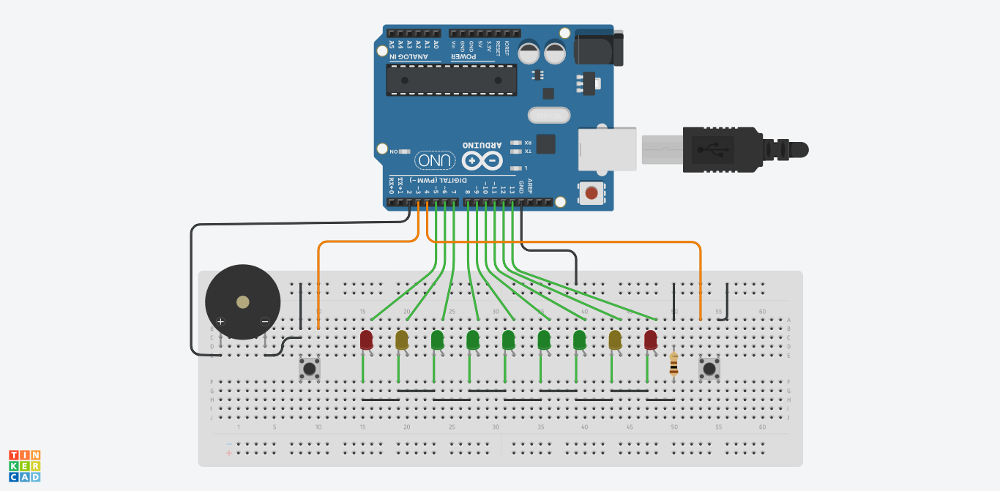

# Arduino LED Pong!

Simple juego al estilo *Pong!* con Arduino, LEDs y pulsadores. Se puede construir como un *shield* o con otro formato. Es un trabajo original de [@newsonator](https://www.instructables.com/Arduino-LED-Pong-Game-a-Fun-Electronics-Project/).

En [Tinkercad](https://www.tinkercad.com/things/hl14mxpcupM-arduino-led-pong) hay disponible un circuito de simulación publico.

